# Display Layout Specification - T-Display S3 Stopwatch

## 📱 Layout Overview

The T-Display S3 features a 320×170 pixel display organized into two main sections: a primary stopwatch area on the left and a status panel on the right. This design provides clear visibility of timing information while maintaining awareness of system status.

## 🎨 Visual Layout

```mermaid
graph TD
    subgraph "T-Display S3 (320×170px)"
        subgraph "Main Area (240×170px)"
            A[Stopwatch Display<br/>240×80px<br/>MM:SS:M format]
            B[Lap 1: 00:45:23<br/>240×30px]
            C[Lap 2: 01:32:11<br/>240×30px]  
            D[Lap 3: 02:03:44<br/>240×30px]
        end
        
        subgraph "Status Area (80×170px)"
            E[WiFi Status<br/>80×40px<br/>Signal/Connection]
            F[WebSocket<br/>80×40px<br/>Server Connection]
            G[Lane Info<br/>80×45px<br/>Lane Number]
            H[Battery<br/>80×45px<br/>Percentage/Voltage]
        end
    end
    
    A --> B
    B --> C
    C --> D
    E --> F
    F --> G
    G --> H
```



## 📐 Detailed Layout Structure

```
┌─────────────────────────────────┬─────────────────┐
│                                 │   WiFi Status   │
│        Main Stopwatch           │   🟢 Connected  │
│         02:03:45                │   -65 dBm       │
│                                 ├─────────────────┤
│                                 │   WebSocket     │
├─────────────────────────────────┤   🟢 Connected  │
│ Lap 1: 00:45:23                │   25ms ping     │
├─────────────────────────────────┼─────────────────┤
│ Lap 2: 01:32:11                │                 │
├─────────────────────────────────┤      Lane       │
│ Lap 3: 02:03:45                │        9        │
└─────────────────────────────────┼─────────────────┤
                                  │    Battery      │
                                  │      75%        │
                                  │    3.8V         │
                                  └─────────────────┘
```

## 🎯 Area Specifications

### Main Display Area (Left Side)
**Total Area**: 240×170 pixels (0,0 to 240,170)

| Area | Dimensions | Position | Function |
|------|------------|----------|----------|
| **Stopwatch** | 240×80px | (0,0) | Main timer display |
| **Lap 1** | 240×30px | (0,80) | First lap time |
| **Lap 2** | 240×30px | (0,110) | Second lap time |
| **Lap 3** | 240×30px | (0,140) | Third lap time |

### Status Area (Right Side)
**Total Area**: 80×170 pixels (240,0 to 320,170)

| Area | Dimensions | Position | Function |
|------|------------|----------|----------|
| **WiFi** | 80×40px | (240,0) | Wi-Fi connection status |
| **WebSocket** | 80×40px | (240,40) | Server connection status |
| **Lane** | 80×45px | (240,80) | Lane number display |
| **Battery** | 80×45px | (240,125) | Power status |

## 🔧 Implementation Constants

```cpp
// Display dimensions
#define DISPLAY_WIDTH  320
#define DISPLAY_HEIGHT 170

// Main area (left side)
#define MAIN_AREA_X      0
#define MAIN_AREA_Y      0
#define MAIN_AREA_WIDTH  240
#define MAIN_AREA_HEIGHT 170

// Status area (right side)
#define STATUS_AREA_X      240
#define STATUS_AREA_Y      0
#define STATUS_AREA_WIDTH  80
#define STATUS_AREA_HEIGHT 170

// Individual area heights
#define AREA_STOPWATCH_HEIGHT    80
#define AREA_LAP_HEIGHT          30
#define AREA_WIFI_HEIGHT         40
#define AREA_WEBSOCKET_HEIGHT    40
#define AREA_LANE_HEIGHT         45
#define AREA_BATTERY_HEIGHT      45

// Y positions for each area
#define AREA_STOPWATCH_Y    0
#define AREA_LAP1_Y         80
#define AREA_LAP2_Y         110
#define AREA_LAP3_Y         140

#define AREA_WIFI_Y         0
#define AREA_WEBSOCKET_Y    40
#define AREA_LANE_Y         80
#define AREA_BATTERY_Y      125
```

## 📝 Font Configuration

### Font Assignments
```cpp
// Font selections for different areas
#define FONT_STOPWATCH  6    // Large font for main timer
#define FONT_LAP        2    // Medium font for lap times
#define FONT_STATUS     1    // Small font for status areas
#define FONT_LANE       2    // Medium font for lane number
```

### Text Alignment
```cpp
// Text datum settings
#define TIME_ALIGNMENT    MC_DATUM  // Middle Center
#define LAP_ALIGNMENT     ML_DATUM  // Middle Left
#define STATUS_ALIGNMENT  MC_DATUM  // Middle Center
```

## 🌈 Color Scheme

### State-Based Colors


### Color Definitions
```cpp
// Primary colors (16-bit RGB565)
#define COLOR_BACKGROUND     0x0000  // Black
#define COLOR_TIME_RUNNING   0x07E0  // Green
#define COLOR_TIME_STOPPED   0xFFE0  // Yellow
#define COLOR_TIME_RESET     0xFFFF  // White
#define COLOR_CONNECTED      0x07E0  // Green
#define COLOR_CONNECTING     0xFFE0  // Yellow
#define COLOR_DISCONNECTED   0xF800  // Red
#define COLOR_STATUS_NORMAL  0x07FF  // Cyan
#define COLOR_LAP_INFO       0xFFE0  // Yellow
#define COLOR_BATTERY_GOOD   0x07E0  // Green
#define COLOR_BATTERY_LOW    0xFFE0  // Yellow
#define COLOR_BATTERY_CRIT   0xF800  // Red
```

## 🔄 Display Update Flow

### Update Process


### Dirty Region Tracking
```cpp
// Dirty flags for efficient updates
bool stopwatchAreaDirty = true;
bool wifiAreaDirty = true;
bool websocketAreaDirty = true;
bool laneAreaDirty = true;
bool batteryAreaDirty = true;
bool lapAreaDirty = true;

// Check if any area needs updating
bool needsUpdate() {
    return stopwatchAreaDirty || wifiAreaDirty || 
           websocketAreaDirty || laneAreaDirty || 
           batteryAreaDirty || lapAreaDirty;
}
```

## 🎮 User Interface States

### State Machine


### Display Messages by State
| State | Main Display | Status Messages |
|-------|-------------|----------------|
| **Startup** | "Initializing..." | WiFi: Connecting |
| **Ready** | "00:00:00" | WiFi: Connected, WS: Connected |
| **Running** | "MM:SS:M" | All status normal |
| **Stopped** | "MM:SS:MM" | Timer stopped indicator |

## 🔧 API Functions Reference

### Main Stopwatch Display
```cpp
// Update the main timer display
void updateStopwatchDisplay(uint32_t elapsedMs, bool isRunning);

// Show startup messages
void showStartupMessage(const String& message);
void clearStartupMessage();

// Legacy compatibility
void showTimeZero();  // Shows 00:00:00
```

### Lap Time Management
```cpp
// Update individual lap display (1-3)
void updateLapTime(uint8_t lapNumber, const String& time);

// Clear all lap displays
void clearLapTimes();

// Legacy array-based update
void updateLapDisplay(const uint8_t* laps, uint8_t lapCount, uint8_t maxDisplay);
```

### Status Area Updates
```cpp
// WiFi status with signal strength
void updateWiFiStatus(const String& status, bool isConnected, int rssi = 0);

// WebSocket status with ping time
void updateWebSocketStatus(const String& status, bool isConnected, int pingMs = -1);

// Lane number display
void updateLaneInfo(uint8_t laneNumber);

// Battery status with percentage
void updateBatteryDisplay(float voltage, uint8_t percentage);
```

### Layout Management
```cpp
// Draw area separator lines
void drawBorders();

// Clear specific areas
void clearArea(int16_t x, int16_t y, int16_t w, int16_t h);
void clearStatusAreas();

// Force complete refresh
void forceRefresh();

// Check if display needs updating
bool needsUpdate();
```

## ⚡ Performance Optimization

### Update Frequency Strategy
```cpp
// Different update intervals for different areas
#define STOPWATCH_UPDATE_MS   100   // 10 FPS for smooth timer
#define STATUS_UPDATE_MS      1000  // 1 FPS for status info
#define LAP_UPDATE_ON_EVENT   true  // Only when lap recorded
```

### Memory Efficiency
```cpp
// String caching to avoid unnecessary redraws
String lastTimeString = "";
String lastWiFiStatus = "";
String lastWebSocketStatus = "";
String lastLaneInfo = "";
String lastBatteryString = "";
String lastLap1 = "";
String lastLap2 = "";
String lastLap3 = "";

// Only update if content changed
if (timeString != lastTimeString || stopwatchAreaDirty) {
    // Perform update
    lastTimeString = timeString;
}
```

### Display Buffer Management
```cpp
// Clear only specific areas to reduce flicker
void clearArea(int16_t x, int16_t y, int16_t w, int16_t h) {
    tft.fillRect(x, y, w, h, COLOR_BACKGROUND);
}

// Batch updates for better performance
void updateStatusAreas() {
    updateWiFiStatus(wifiStatus, isConnected);
    updateWebSocketStatus(wsStatus, wsConnected);
    updateBatteryDisplay(voltage, percentage);
}
```

## 🎨 Styling Guidelines

### Typography
- **Stopwatch**: Large, bold, easy to read from distance
- **Laps**: Medium size, clear lap identification
- **Status**: Small but readable, efficient space usage
- **Messages**: Consistent with status areas

### Color Psychology
- **Green**: Success, active, good status
- **Red**: Error, danger, attention needed
- **Yellow**: Warning, caution, temporary state
- **Cyan**: Information, neutral status
- **White**: Default text, high contrast

### Animation Principles
- **No animations**: Prioritize performance and battery life
- **Instant updates**: Immediate response to state changes
- **Smooth timing**: 100ms update interval for timer display
- **Minimal flicker**: Clear only changed areas

## 🔧 Integration Examples

### Main Application Integration
```cpp
void setup() {
    // Initialize display with splash screen
    display.init();
    display.showSplashScreen();
    
    // Setup layout
    display.drawBorders();
    display.updateLaneInfo(laneNumber);
    
    // Show initial status
    display.showStartupMessage("Connecting WiFi...");
}

void loop() {
    static uint32_t lastDisplayUpdate = 0;
    static uint32_t lastStatusUpdate = 0;
    uint32_t now = millis();
    
    // Update timer display (100ms)
    if (now - lastDisplayUpdate >= 100) {
        display.updateStopwatchDisplay(
            stopwatch.getElapsedTime(), 
            stopwatch.isRunning()
        );
        lastDisplayUpdate = now;
    }
    
    // Update status areas (1000ms)
    if (now - lastStatusUpdate >= 1000) {
        updateAllStatusAreas();
        lastStatusUpdate = now;
    }
}
```

### Event-Driven Updates
```cpp
void onLapRecorded(uint8_t lapNumber, const String& lapTime) {
    display.updateLapTime(lapNumber, lapTime);
}

void onWiFiStatusChanged(bool connected, int rssi) {
    String status = connected ? "Connected" : "Disconnected";
    display.updateWiFiStatus(status, connected, rssi);
}

void onWebSocketEvent(webSocketEvent_t type) {
    switch(type) {
        case WStype_CONNECTED:
            display.updateWebSocketStatus("Connected", true);
            break;
        case WStype_DISCONNECTED:
            display.updateWebSocketStatus("Disconnected", false);
            break;
        case WStype_ERROR:
            display.updateWebSocketStatus("Error", false);
            break;
    }
}
```

## 📱 Responsive Design

### Rotation Support
```cpp
void setRotation(uint8_t rotation) {
    tft.setRotation(rotation);
    
    // Recalculate dimensions based on rotation
    if (rotation % 2 == 0) {
        // Portrait modes
        displayWidth = 170;
        displayHeight = 320;
    } else {
        // Landscape modes  
        displayWidth = 320;
        displayHeight = 170;
    }
    
    forceRefresh(); // Redraw everything
}
```

### Scalability Considerations
- Areas are defined proportionally
- Font sizes can be adjusted based on display size
- Color scheme remains consistent across configurations
- Layout adapts to different orientations

## 🛠️ Troubleshooting

### Common Display Issues
| Issue | Cause | Solution |
|-------|-------|----------|
| **Flickering** | Full screen refreshes | Use dirty region updates |
| **Slow updates** | Inefficient drawing | Cache strings, minimal clears |
| **Garbled text** | Wrong font/color | Check TFT_eSPI configuration |
| **Areas overlap** | Wrong coordinates | Verify area calculations |
| **Colors wrong** | RGB565 format | Use correct color constants |

### Debug Functions
```cpp
void debugDisplayAreas() {
    // Draw colored rectangles to show areas
    tft.drawRect(MAIN_AREA_X, MAIN_AREA_Y, MAIN_AREA_WIDTH, MAIN_AREA_HEIGHT, TFT_RED);
    tft.drawRect(STATUS_AREA_X, STATUS_AREA_Y, STATUS_AREA_WIDTH, STATUS_AREA_HEIGHT, TFT_BLUE);
}

void printAreaInfo() {
    Serial.println("=== Display Area Information ===");
    Serial.printf("Main Area: %dx%d at (%d,%d)\n", 
                  MAIN_AREA_WIDTH, MAIN_AREA_HEIGHT, MAIN_AREA_X, MAIN_AREA_Y);
    Serial.printf("Status Area: %dx%d at (%d,%d)\n",
                  STATUS_AREA_WIDTH, STATUS_AREA_HEIGHT, STATUS_AREA_X, STATUS_AREA_Y);
}
```

---

## 📚 Related Documentation

- [Main README](../README.md) - Project overview and setup
- [Hardware Specifications](HARDWARE.md) - Physical device details  
- [API Reference](API.md) - Complete function documentation
- [TFT_eSPI Library](https://github.com/Bodmer/TFT_eSPI) - Display driver documentation
