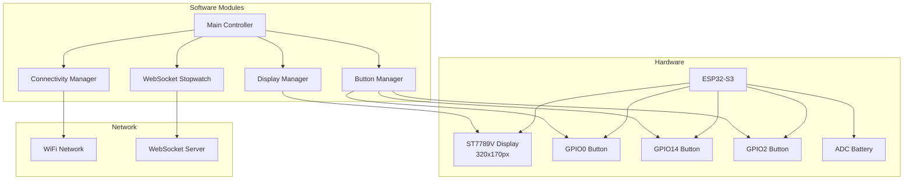
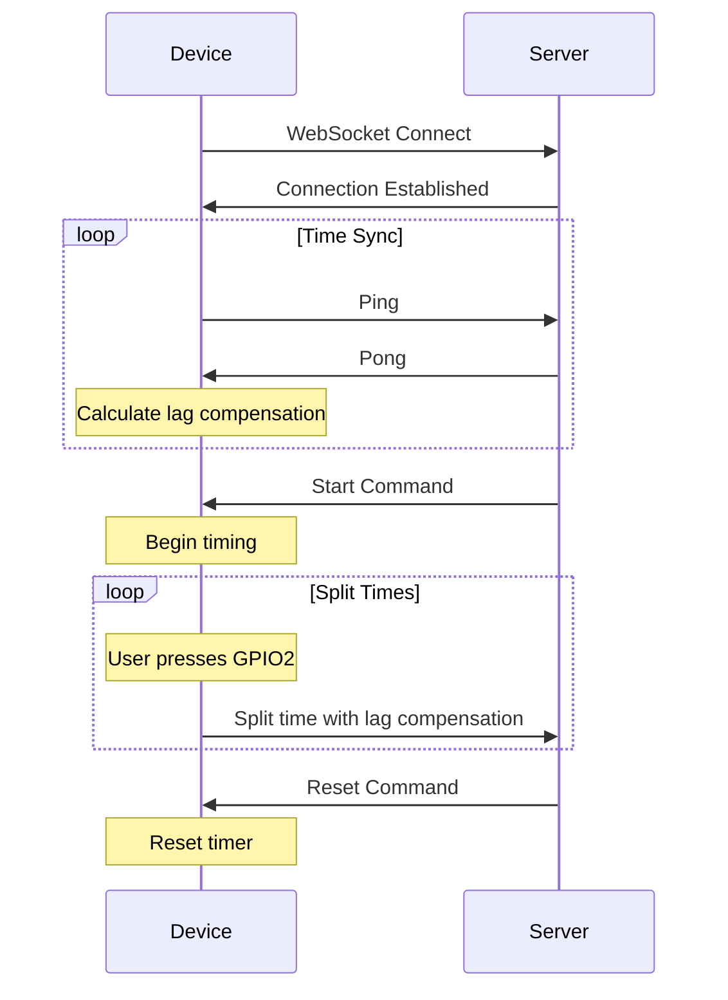
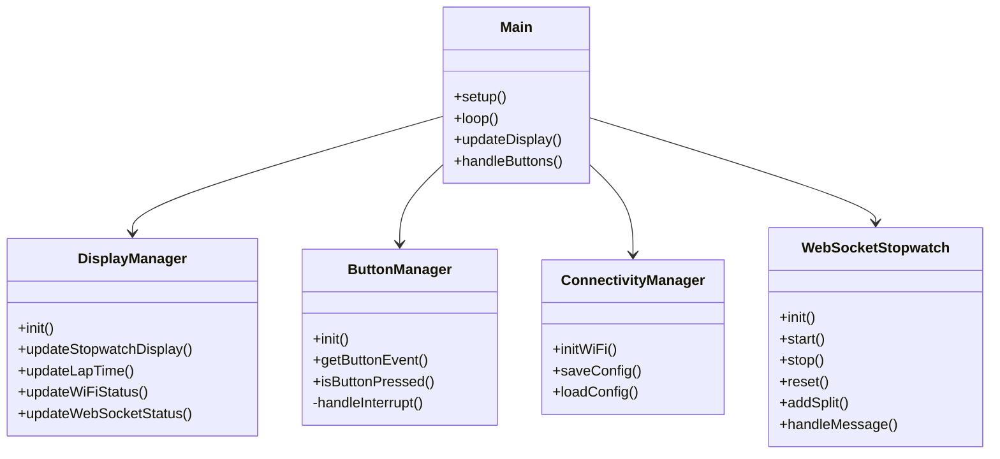

# T-Display S3 Stopwatch System

A comprehensive stopwatch system for the LilyGO T-Display S3 (ESP32-S3) with Wi-Fi connectivity, WebSocket integration, and modular architecture.

## 🎯 Features

- **Remote-Controlled Stopwatch**: Start/reset via WebSocket commands
- **Split Timer**: Record multiple split times during operation
- **Wi-Fi Connectivity**: Auto-connect with configuration portal fallback
- **Real-time Synchronization**: WebSocket time sync with lag compensation
- **Modular Design**: Clean, maintainable code architecture
- **Visual Status Display**: Real-time WiFi, WebSocket, lane, and battery status

## 🏗️ System Architecture



## 🔧 Hardware Setup

### LilyGO T-Display S3 Specifications
- **MCU**: ESP32-S3R8 Dual-core LX7 microprocessor
- **Display**: 1.9" ST7789V IPS LCD (170x320 pixels)
- **Flash**: 16MB, **PSRAM**: 8MB
- **Connectivity**: Wi-Fi 802.11 b/g/n, BLE 5.0 + BT mesh
- **Power**: 3.3V operating voltage

### Button Configuration
```
GPIO0  (BUTTON1): Start/Lap - Internal pullup, active LOW
GPIO14 (BUTTON2): Stop/Reset - Internal pullup, active LOW  
GPIO2  (BUTTON3): Split Timer - External pulldown REQUIRED, active HIGH
```

⚠️ **IMPORTANT for GPIO2**: Connect a 1kΩ resistor between GPIO2 and GND (external pulldown required)

### Pin Assignment
```cpp
// Display pins (handled by TFT_eSPI)
#define TFT_MOSI     19
#define TFT_SCLK     18
#define TFT_CS       5
#define TFT_DC       16
#define TFT_BL       4

// Button pins
#define BUTTON1_PIN  0   // Start/Lap
#define BUTTON2_PIN  14  // Stop/Reset
#define BUTTON3_PIN  2   // Split (external pulldown required)

// Other pins
#define I2C_SDA      21
#define I2C_SCL      22
#define ADC_IN       34
```

## 📱 Display Layout

The display is divided into main and status areas:

```
┌─────────────────────────────────┬─────────────────┐
│                                 │   WiFi Status   │
│       Main Stopwatch            │   🟢 Connected  │
│        02:03:45                 │                 │
│                                 ├─────────────────┤
│                                 │  WebSocket      │
├─────────────────────────────────┤  🟢 Connected   │
│ Lap 1: 00:45:23                │                 │
├─────────────────────────────────┼─────────────────┤
│ Lap 2: 01:32:11                │                 │
├─────────────────────────────────┤      Lane       │
│ Lap 3: 02:03:45                │        9        │
└─────────────────────────────────┼─────────────────┤
                                  │    Battery      │
                                  │      75%        │
                                  └─────────────────┘
```

### Area Specifications
- **Main Area**: 240x170px (Stopwatch + 3 Lap times)
- **Status Area**: 80x170px (WiFi, WebSocket, Lane, Battery)
- **Time Format**: 
  - Running: `mm:ss:m` (1 digit milliseconds)
  - Stopped: `mm:ss:mm` (2 digit milliseconds)

## 🚀 Quick Start

### 1. Initial Setup
1. Flash the firmware to your T-Display S3
2. On first boot, device creates WiFi hotspot: `T-Display-S3-Config`
3. Connect to hotspot with password: `stopwatch123`
4. Navigate to `http://192.168.4.1` for configuration

### 2. Configuration
Configure the following settings:
- **WiFi Network**: Your local WiFi credentials
- **WebSocket Server**: Server address (default: `scherm.azckamp.nl`)
- **WebSocket Port**: Port number (default: `443` for SSL)
- **Lane Number**: Lane identifier (default: `9`)

### 3. Operation Modes

#### Standalone Mode
- **Start**: Press GPIO0 or GPIO2
- **Lap**: Press GPIO0 while running
- **Stop**: Press GPIO14
- **Reset**: Press GPIO14 when stopped

#### Remote Mode (WebSocket)
- **Start**: Via WebSocket command only
- **Split**: Press GPIO2 to create split times
- **Reset**: Via WebSocket command or GPIO14

## 🔌 WebSocket Protocol

### Message Format
All messages use JSON format:

#### Received Messages
```json
{"type": "start", "timestamp": 1234567890}
{"type": "reset"}
{"type": "time_sync", "server_time": 1234567890}
```

#### Sent Messages
```json
{
  "type": "split",
  "lane": "9",
  "time-ms": 1234567890,
  "time": "MM:SS:CC"
}
```

### Connection Flow


## 📚 Software Architecture

### Module Overview


### Key Components

#### 1. ConnectivityManager
- WiFi connection management  
- Configuration storage (Preferences)
- Captive portal setup for configuration

#### 2. DisplayManager
- Modular display areas
- Efficient dirty-region updates
- Color-coded status indicators
- Font and layout management

#### 3. ButtonManager
- Hardware interrupt-driven
- Software debouncing
- Multiple button support
- Event-based architecture

#### 4. WebSocketStopwatch
- SSL WebSocket connection
- Lag compensation
- Server time synchronization
- Split time management

## 🛠️ Development

### Build Requirements
```ini
[env:lilygo-t-display-s3]
platform = espressif32
board = lilygo-t-display-s3
framework = arduino
lib_deps = 
    links2004/WebSockets @ ^2.4.1
    bblanchon/ArduinoJson @ ^6.21.3
```

### Project Structure
```
stopwatch/
├── platformio.ini          # Build configuration
├── include/                # Header files
│   ├── display_manager.h
│   ├── button_manager.h
│   ├── connectivity.h
│   └── websocket_stopwatch.h
├── src/                    # Source files
│   ├── main.cpp
│   ├── display_manager.cpp
│   ├── button_manager.cpp
│   ├── connectivity.cpp
│   └── websocket_stopwatch.cpp
├── lib/                    # Local libraries
│   └── TFT_eSPI/          # Display driver
└── docs/                   # Documentation
```

### Building and Flashing
```bash
# Build the project
pio run

# Flash to device
pio run --target upload

# Monitor serial output
pio device monitor
```

## 🔍 Troubleshooting

### Common Issues

| Issue | Possible Cause | Solution |
|-------|---------------|----------|
| No WiFi connection | Wrong credentials | Reset config, reconfigure |
| GPIO2 not working | Missing pulldown | Add 1kΩ resistor to GND |
| WebSocket fails | Server unreachable | Check server address/port |
| Display garbled | TFT_eSPI config | Verify pin assignments |
| Time drift | Timer accuracy | Internal ESP32 timer is accurate |

### Reset Procedures

#### Full Reset
1. Hold GPIO0 + GPIO14 during power-on
2. Device enters configuration mode
3. Reconfigure via web portal

#### Config Reset
1. Delete `/config.json` via serial commands
2. Device will start configuration portal

### Debug Information
Monitor serial output at 115200 baud for:
- System initialization
- WiFi connection status
- WebSocket messages
- Button events
- Timing information
- Error messages

## 📊 Performance Metrics

### Timing Accuracy
- **Display Update**: 100ms intervals
- **Button Response**: <10ms (interrupt-driven)
- **WebSocket Latency**: Auto-compensated
- **Internal Timer**: ±1ms accuracy using millis()

### Power Consumption
- **Active Mode**: ~150mA (display on)
- **Sleep Mode**: ~5mA (display off)
- **Battery Life**: 8-12 hours continuous use

## 🔄 Future Enhancements

- [ ] Touch screen support
- [ ] SD card logging
- [ ] Bluetooth connectivity
- [ ] Multi-language support
- [ ] Advanced timing statistics
- [ ] Over-the-air updates

## 📄 License

This project is open source. See individual library licenses for dependencies.

## 🤝 Contributing

Contributions welcome! Please read the contributing guidelines and submit pull requests for any improvements.

---

For detailed technical documentation, see:
- [Display Layout Details](docs/DISPLAY_LAYOUT.md)
- [Hardware Specifications](docs/HARDWARE.md)
- [API Reference](docs/API.md)
