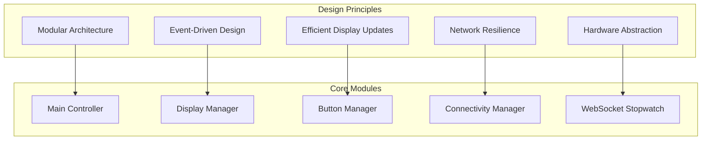
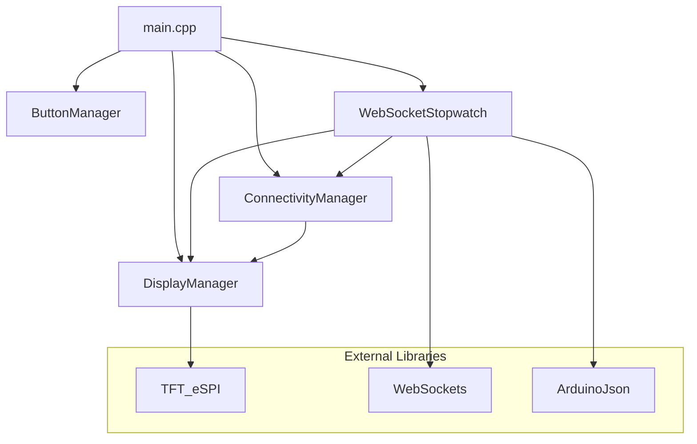

# Developer Guide - T-Display S3 Stopwatch

## 🎯 Project Overview

This guide provides comprehensive information for developers working on the T-Display S3 Stopwatch project. The system is built with a modular architecture designed for maintainability, extensibility, and performance.

## 🏗️ Architecture Overview

### System Design Philosophy


### Module Dependencies


## 🛠️ Development Environment Setup

### Required Tools
```bash
# PlatformIO CLI (recommended)
pip install platformio

# Or use PlatformIO IDE extension for VS Code
# Install: ms-vscode.vscode-platformio-ide
```

### Project Structure
```
stopwatch/
├── platformio.ini          # Build configuration
├── include/                # Header files
│   ├── display_manager.h   # Display control
│   ├── button_manager.h    # Hardware buttons
│   ├── connectivity.h      # WiFi management
│   └── websocket_stopwatch.h # WebSocket & timing
├── src/                    # Implementation files
│   ├── main.cpp           # Main application
│   ├── display_manager.cpp
│   ├── button_manager.cpp
│   ├── connectivity.cpp
│   └── websocket_stopwatch.cpp
├── lib/                    # Local libraries
│   └── TFT_eSPI/          # Custom display config
├── docs/                   # Documentation
│   ├── README.md          # Main documentation
│   ├── API.md            # API reference
│   ├── HARDWARE.md       # Hardware specs
│   └── DISPLAY_LAYOUT.md # Display layout
└── examples/              # Example code
    ├── simple/            # Basic stopwatch
    └── display_test/      # Display testing
```

### Build Configuration
```ini
; platformio.ini
[env:lilygo-t-display-s3]
platform = espressif32
board = lilygo-t-display-s3
framework = arduino

; Build settings
build_flags = 
    -DCORE_DEBUG_LEVEL=3
    -DWIFI_MANAGER_DEBUG
    -DWEBSOCKETS_DEBUG
    -DTFT_WIDTH=170
    -DTFT_HEIGHT=320

; Library dependencies
lib_deps = 
    links2004/WebSockets @ ^2.4.1
    bblanchon/ArduinoJson @ ^6.21.3

; Monitor settings
monitor_speed = 115200
monitor_filters = esp32_exception_decoder
```

## 🔧 Code Standards and Guidelines

### Coding Style
```cpp
// File header template
/*
 * filename.cpp - Brief description
 * 
 * Part of T-Display S3 Stopwatch System
 * 
 * Author: [Your Name]
 * Date: [Date]
 * Version: [Version]
 */

// Include order
#include <Arduino.h>          // Arduino core
#include <WiFi.h>            // ESP32 libraries
#include "local_header.h"    // Local headers

// Naming conventions
class DisplayManager {       // PascalCase for classes
    private:
        uint32_t lastUpdate;     // camelCase for variables
        static const int MAX_LAPS = 3;  // UPPER_CASE for constants
        
    public:
        void updateDisplay();    // camelCase for functions
        bool isConnected();      // boolean functions start with 'is'
};

// Constants and defines
#define PIN_BUTTON1  0          // Hardware constants
static const uint32_t TIMEOUT_MS = 5000;  // Software constants

// Function documentation
/**
 * @brief Updates the stopwatch display
 * @param elapsedMs Elapsed time in milliseconds
 * @param isRunning Whether the timer is currently running
 * @return true if display was updated, false if no change needed
 */
bool updateStopwatchDisplay(uint32_t elapsedMs, bool isRunning);
```

### Error Handling
```cpp
// Return codes for functions
enum class Result {
    SUCCESS = 0,
    ERROR_INIT_FAILED,
    ERROR_CONNECTION_LOST,
    ERROR_INVALID_PARAMETER
};

// Exception handling pattern
Result DisplayManager::init() {
    if (!tft.begin()) {
        Serial.println("ERROR: TFT initialization failed");
        return Result::ERROR_INIT_FAILED;
    }
    
    Serial.println("Display initialized successfully");
    return Result::SUCCESS;
}

// Check and handle errors
if (display.init() != Result::SUCCESS) {
    Serial.println("FATAL: Cannot initialize display");
    while(1) delay(1000); // Halt execution
}
```

### Memory Management
```cpp
// Use PROGMEM for constant strings
const char WIFI_CONNECTING[] PROGMEM = "Connecting to WiFi...";
const char WEBSOCKET_ERROR[] PROGMEM = "WebSocket connection failed";

// Access PROGMEM strings
void showMessage(const char* progmemStr) {
    char buffer[64];
    strcpy_P(buffer, progmemStr);
    display.showMessage(buffer);
}

// Minimize string operations
void updateTimeDisplay(uint32_t ms) {
    static String lastTimeStr = "";
    String currentTimeStr = formatTime(ms);
    
    if (currentTimeStr != lastTimeStr) {
        display.updateTime(currentTimeStr);
        lastTimeStr = currentTimeStr;
    }
}
```

## 🖥️ Display System Development

### Custom Display Areas
```cpp
// Creating new display areas
class CustomArea {
private:
    int16_t x, y, width, height;
    String lastContent;
    bool isDirty;
    
public:
    CustomArea(int16_t x, int16_t y, int16_t w, int16_t h) 
        : x(x), y(y), width(w), height(h), isDirty(true) {}
    
    void update(const String& content) {
        if (content != lastContent || isDirty) {
            tft.fillRect(x, y, width, height, COLOR_BACKGROUND);
            tft.drawString(content, x + width/2, y + height/2);
            lastContent = content;
            isDirty = false;
        }
    }
    
    void markDirty() { isDirty = true; }
};
```

### Font Management
```cpp
// Font selection strategy
uint8_t selectFont(const String& text, int16_t maxWidth, int16_t maxHeight) {
    for (uint8_t font = 8; font >= 1; font--) {
        tft.setTextFont(font);
        if (tft.textWidth(text) <= maxWidth && 
            tft.fontHeight() <= maxHeight) {
            return font;
        }
    }
    return 1; // Fallback to smallest font
}

// Dynamic text sizing
void drawFittedText(const String& text, int16_t x, int16_t y, 
                   int16_t maxW, int16_t maxH) {
    uint8_t font = selectFont(text, maxW, maxH);
    tft.setTextFont(font);
    tft.drawString(text, x, y);
}
```

### Color Theming
```cpp
// Color theme system
struct ColorTheme {
    uint16_t background;
    uint16_t text;
    uint16_t accent;
    uint16_t warning;
    uint16_t error;
};

const ColorTheme DARK_THEME = {
    .background = 0x0000,  // Black
    .text = 0xFFFF,        // White
    .accent = 0x07E0,      // Green
    .warning = 0xFFE0,     // Yellow
    .error = 0xF800        // Red
};

const ColorTheme LIGHT_THEME = {
    .background = 0xFFFF,  // White
    .text = 0x0000,        // Black
    .accent = 0x001F,      // Blue
    .warning = 0xF800,     // Red
    .error = 0x7800        // Dark Red
};

// Apply theme
void applyTheme(const ColorTheme& theme) {
    COLOR_BACKGROUND = theme.background;
    COLOR_TEXT = theme.text;
    // ... apply other colors
    display.forceRefresh();
}
```

## 🔘 Button System Development

### Advanced Button Handling
```cpp
// Button state machine
enum ButtonState {
    IDLE,
    PRESSED,
    HELD,
    RELEASED
};

class AdvancedButton {
private:
    uint8_t pin;
    ButtonState state;
    uint32_t pressTime;
    uint32_t lastDebounce;
    bool lastReading;
    
    static const uint32_t DEBOUNCE_DELAY = 50;
    static const uint32_t HOLD_THRESHOLD = 1000;
    
public:
    void update() {
        bool reading = digitalRead(pin) == LOW; // Active low
        uint32_t now = millis();
        
        if (reading != lastReading) {
            lastDebounce = now;
        }
        
        if ((now - lastDebounce) > DEBOUNCE_DELAY) {
            switch (state) {
                case IDLE:
                    if (reading) {
                        state = PRESSED;
                        pressTime = now;
                    }
                    break;
                    
                case PRESSED:
                    if (!reading) {
                        state = RELEASED;
                    } else if ((now - pressTime) > HOLD_THRESHOLD) {
                        state = HELD;
                    }
                    break;
                    
                case HELD:
                    if (!reading) {
                        state = RELEASED;
                    }
                    break;
                    
                case RELEASED:
                    state = IDLE;
                    break;
            }
        }
        
        lastReading = reading;
    }
    
    ButtonState getState() { return state; }
    uint32_t getPressTime() { return millis() - pressTime; }
};
```

### Gesture Recognition
```cpp
// Multi-button gesture detection
class GestureDetector {
private:
    struct ButtonPress {
        uint8_t button;
        uint32_t timestamp;
    };
    
    ButtonPress history[10];
    uint8_t historyIndex = 0;
    
public:
    enum Gesture {
        NONE,
        DOUBLE_TAP,
        LONG_PRESS,
        COMBO_PRESS,
        SEQUENCE_123
    };
    
    void recordPress(uint8_t button) {
        history[historyIndex] = {button, millis()};
        historyIndex = (historyIndex + 1) % 10;
    }
    
    Gesture detectGesture() {
        uint32_t now = millis();
        
        // Check for double tap (same button within 500ms)
        if (historyIndex >= 2) {
            auto& last = history[(historyIndex - 1) % 10];
            auto& prev = history[(historyIndex - 2) % 10];
            
            if (last.button == prev.button && 
                (last.timestamp - prev.timestamp) < 500) {
                return DOUBLE_TAP;
            }
        }
        
        // Check for button sequence
        if (historyIndex >= 3) {
            auto& b1 = history[(historyIndex - 3) % 10];
            auto& b2 = history[(historyIndex - 2) % 10];
            auto& b3 = history[(historyIndex - 1) % 10];
            
            if (b1.button == 1 && b2.button == 2 && b3.button == 3 &&
                (b3.timestamp - b1.timestamp) < 2000) {
                return SEQUENCE_123;
            }
        }
        
        return NONE;
    }
};
```

## 🌐 Network Development

### WebSocket Message Protocol
```cpp
// Message format definitions
struct StartMessage {
    String type = "start";
    uint32_t timestamp;
    String lane;
    
    String toJson() {
        return "{\"type\":\"start\",\"timestamp\":" + String(timestamp) + 
               ",\"lane\":\"" + lane + "\"}";
    }
};

struct SplitMessage {
    String type = "split";
    String lane;
    uint32_t timeMs;
    String timeFormatted;
    
    String toJson() {
        return "{\"type\":\"split\",\"lane\":\"" + lane + 
               "\",\"time-ms\":" + String(timeMs) + 
               ",\"time\":\"" + timeFormatted + "\"}";
    }
};

// Message parser
class MessageParser {
public:
    static bool parseStartMessage(const String& json, StartMessage& msg) {
        DynamicJsonDocument doc(1024);
        deserializeJson(doc, json);
        
        if (doc["type"].as<String>() == "start") {
            msg.timestamp = doc["timestamp"].as<uint32_t>();
            msg.lane = doc["lane"].as<String>();
            return true;
        }
        return false;
    }
};
```

### Connection Recovery
```cpp
// Robust connection management
class ConnectionManager {
private:
    enum State {
        DISCONNECTED,
        CONNECTING,
        CONNECTED,
        RECONNECTING
    };
    
    State currentState = DISCONNECTED;
    uint32_t lastConnectionAttempt = 0;
    uint32_t reconnectDelay = 1000;
    uint8_t reconnectAttempts = 0;
    
    static const uint8_t MAX_RECONNECT_ATTEMPTS = 5;
    static const uint32_t MAX_RECONNECT_DELAY = 30000;
    
public:
    void update() {
        uint32_t now = millis();
        
        switch (currentState) {
            case DISCONNECTED:
                if (WiFi.status() == WL_CONNECTED) {
                    startConnection();
                }
                break;
                
            case CONNECTING:
                if (webSocket.isConnected()) {
                    currentState = CONNECTED;
                    reconnectAttempts = 0;
                    reconnectDelay = 1000;
                    Serial.println("WebSocket connected");
                } else if ((now - lastConnectionAttempt) > 10000) {
                    currentState = RECONNECTING;
                }
                break;
                
            case CONNECTED:
                if (!webSocket.isConnected()) {
                    Serial.println("Connection lost, attempting reconnect");
                    currentState = RECONNECTING;
                }
                break;
                
            case RECONNECTING:
                if ((now - lastConnectionAttempt) > reconnectDelay) {
                    if (reconnectAttempts < MAX_RECONNECT_ATTEMPTS) {
                        startConnection();
                        reconnectAttempts++;
                        reconnectDelay = min(reconnectDelay * 2, MAX_RECONNECT_DELAY);
                    } else {
                        Serial.println("Max reconnect attempts reached");
                        currentState = DISCONNECTED;
                    }
                }
                break;
        }
    }
    
private:
    void startConnection() {
        webSocket.begin(serverUrl, port, "/ws");
        lastConnectionAttempt = millis();
        currentState = CONNECTING;
    }
};
```

## 🔧 Testing and Debugging

### Unit Testing Framework
```cpp
// Simple unit testing
class TestFramework {
private:
    int testsPassed = 0;
    int testsFailed = 0;
    String currentTest;
    
public:
    void startTest(const String& name) {
        currentTest = name;
        Serial.println("Testing: " + name);
    }
    
    void assertEqual(int expected, int actual) {
        if (expected == actual) {
            Serial.println("  ✓ PASS");
            testsPassed++;
        } else {
            Serial.println("  ✗ FAIL: Expected " + String(expected) + 
                          ", got " + String(actual));
            testsFailed++;
        }
    }
    
    void assertTrue(bool condition, const String& message = "") {
        if (condition) {
            Serial.println("  ✓ PASS: " + message);
            testsPassed++;
        } else {
            Serial.println("  ✗ FAIL: " + message);
            testsFailed++;
        }
    }
    
    void printResults() {
        Serial.println("\n=== Test Results ===");
        Serial.println("Passed: " + String(testsPassed));
        Serial.println("Failed: " + String(testsFailed));
        Serial.println("Total:  " + String(testsPassed + testsFailed));
    }
};

// Example tests
void runDisplayTests() {
    TestFramework test;
    DisplayManager display;
    
    test.startTest("Display Initialization");
    test.assertTrue(display.init(), "Display should initialize");
    
    test.startTest("Time Formatting");
    String formatted = display.formatStopwatchTime(125000, true);
    test.assertEqual("02:05:1", formatted);
    
    test.printResults();
}
```

### Debug Utilities
```cpp
// Memory monitoring
void printMemoryInfo() {
    Serial.println("\n=== Memory Info ===");
    Serial.printf("Free heap: %d bytes\n", ESP.getFreeHeap());
    Serial.printf("Heap size: %d bytes\n", ESP.getHeapSize());
    Serial.printf("Min free heap: %d bytes\n", ESP.getMinFreeHeap());
    Serial.printf("Max alloc heap: %d bytes\n", ESP.getMaxAllocHeap());
    
    if (psramFound()) {
        Serial.printf("PSRAM size: %d bytes\n", ESP.getPsramSize());
        Serial.printf("Free PSRAM: %d bytes\n", ESP.getFreePsram());
    }
}

// Performance monitoring
class PerformanceMonitor {
private:
    struct Timing {
        String name;
        uint32_t startTime;
        uint32_t totalTime;
        uint32_t callCount;
    };
    
    Timing timings[10];
    uint8_t timingCount = 0;
    
public:
    void startTiming(const String& name) {
        for (uint8_t i = 0; i < timingCount; i++) {
            if (timings[i].name == name) {
                timings[i].startTime = micros();
                return;
            }
        }
        
        // New timing
        if (timingCount < 10) {
            timings[timingCount] = {name, micros(), 0, 0};
            timingCount++;
        }
    }
    
    void endTiming(const String& name) {
        uint32_t endTime = micros();
        
        for (uint8_t i = 0; i < timingCount; i++) {
            if (timings[i].name == name) {
                timings[i].totalTime += (endTime - timings[i].startTime);
                timings[i].callCount++;
                return;
            }
        }
    }
    
    void printReport() {
        Serial.println("\n=== Performance Report ===");
        for (uint8_t i = 0; i < timingCount; i++) {
            float avgTime = (float)timings[i].totalTime / timings[i].callCount;
            Serial.printf("%s: %.2f μs avg (%d calls)\n", 
                         timings[i].name.c_str(), avgTime, timings[i].callCount);
        }
    }
};

// Usage example
PerformanceMonitor perfMon;

void updateDisplay() {
    perfMon.startTiming("Display Update");
    
    // Display update code here
    
    perfMon.endTiming("Display Update");
}
```

## 🚀 Deployment and Distribution

### Version Management
```cpp
// Version information
#define VERSION_MAJOR 1
#define VERSION_MINOR 2
#define VERSION_PATCH 3
#define VERSION_BUILD 42

#define VERSION_STRING "1.2.3-42"
#define BUILD_DATE __DATE__
#define BUILD_TIME __TIME__

void printVersionInfo() {
    Serial.println("=== T-Display S3 Stopwatch ===");
    Serial.println("Version: " VERSION_STRING);
    Serial.println("Built: " BUILD_DATE " " BUILD_TIME);
    Serial.printf("ESP32 SDK: %s\n", ESP.getSdkVersion());
    Serial.printf("Arduino Core: %s\n", ARDUINO_ESP32_RELEASE);
}
```

### Over-The-Air (OTA) Updates
```cpp
#include <ArduinoOTA.h>

void setupOTA() {
    ArduinoOTA.setHostname("t-display-s3-stopwatch");
    ArduinoOTA.setPassword("your_ota_password");
    
    ArduinoOTA.onStart([]() {
        String type = (ArduinoOTA.getCommand() == U_FLASH) ? "sketch" : "filesystem";
        Serial.println("Start updating " + type);
        display.showStartupMessage("OTA Update...");
    });
    
    ArduinoOTA.onEnd([]() {
        Serial.println("\nOTA Update complete");
        display.showStartupMessage("Update Complete");
    });
    
    ArduinoOTA.onProgress([](unsigned int progress, unsigned int total) {
        int percent = (progress / (total / 100));
        Serial.printf("Progress: %u%%\r", percent);
        display.showStartupMessage("Updating " + String(percent) + "%");
    });
    
    ArduinoOTA.onError([](ota_error_t error) {
        Serial.printf("OTA Error[%u]: ", error);
        if (error == OTA_AUTH_ERROR) Serial.println("Auth Failed");
        else if (error == OTA_BEGIN_ERROR) Serial.println("Begin Failed");
        else if (error == OTA_CONNECT_ERROR) Serial.println("Connect Failed");
        else if (error == OTA_RECEIVE_ERROR) Serial.println("Receive Failed");
        else if (error == OTA_END_ERROR) Serial.println("End Failed");
        
        display.showStartupMessage("Update Failed");
    });
    
    ArduinoOTA.begin();
}
```

### Production Configuration
```cpp
// Production vs Development settings
#ifdef PRODUCTION_BUILD
    #define DEBUG_LEVEL 1
    #define ENABLE_OTA false
    #define DEFAULT_SERVER "production.server.com"
#else
    #define DEBUG_LEVEL 4
    #define ENABLE_OTA true
    #define DEFAULT_SERVER "dev.server.com"
#endif

// Feature flags
struct FeatureFlags {
    bool enableTouchscreen = false;
    bool enableBluetooth = false;
    bool enableSDLogging = false;
    bool enableWebInterface = true;
    bool enableOTA = ENABLE_OTA;
};

extern FeatureFlags features;
```

## 📚 Contributing Guidelines

### Pull Request Process
1. **Fork** the repository
2. **Create** feature branch: `git checkout -b feature/amazing-feature`
3. **Follow** coding standards and add tests
4. **Commit** changes: `git commit -m 'Add amazing feature'`
5. **Push** to branch: `git push origin feature/amazing-feature`
6. **Open** pull request with detailed description

### Code Review Checklist
- [ ] Code follows project style guidelines
- [ ] All functions have proper documentation
- [ ] Error handling is implemented
- [ ] Memory usage is optimized
- [ ] Performance impact is considered
- [ ] Tests are included and passing
- [ ] Documentation is updated

### Issue Reporting
```markdown
**Bug Report Template**
- **Device**: LilyGO T-Display S3
- **Firmware Version**: 1.2.3
- **Arduino Core**: 2.0.x
- **Description**: Clear description of the issue
- **Steps to Reproduce**: 
  1. Step one
  2. Step two
  3. Step three
- **Expected Behavior**: What should happen
- **Actual Behavior**: What actually happens
- **Serial Output**: Include relevant serial output
- **Additional Context**: Any other relevant information
```

---

## 📖 Additional Resources

- [ESP32-S3 Technical Reference](https://www.espressif.com/sites/default/files/documentation/esp32-s3_technical_reference_manual_en.pdf)
- [Arduino Core for ESP32](https://github.com/espressif/arduino-esp32)
- [PlatformIO Documentation](https://docs.platformio.org/)
- [TFT_eSPI Library](https://github.com/Bodmer/TFT_eSPI)
- [WebSockets Library](https://github.com/Links2004/arduinoWebSockets)
- [ArduinoJson Library](https://arduinojson.org/)

Happy coding! 🚀
